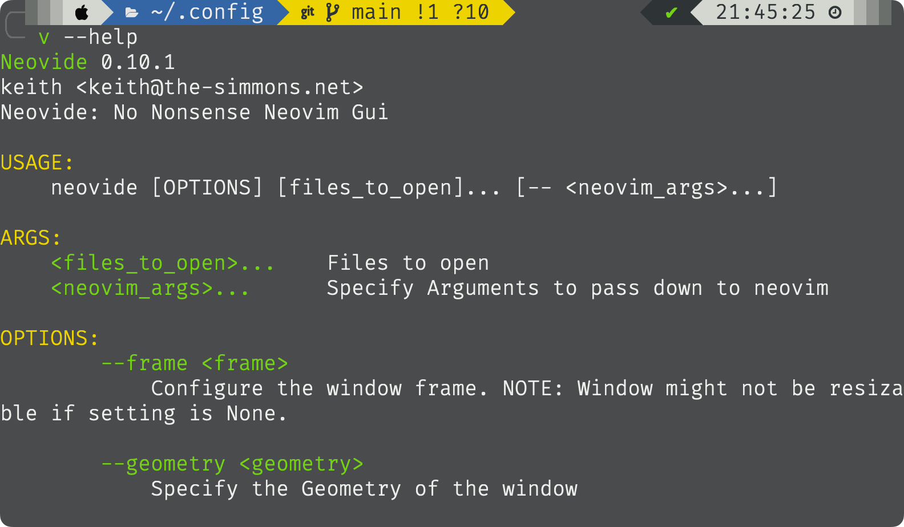
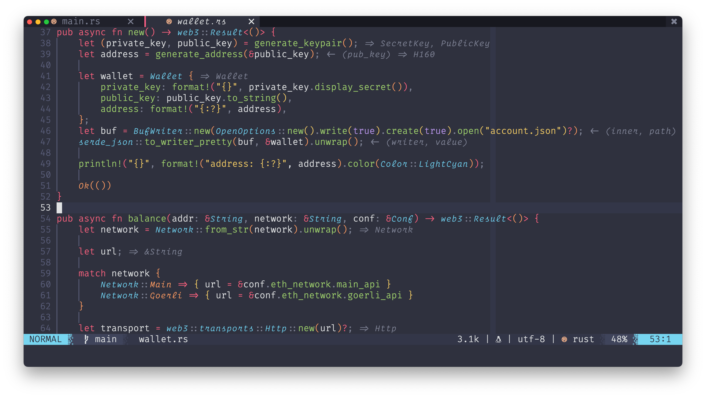

:sparkles: pretty cool **neovim** and **Alacritty** config

:sparkles: contain great italic fonts. Install and configure it in `nvim/lua/neovide.lua` and `alacritty/alacritty.yml`

- Also provide neovide(GUI) configuration
    - set these in `~/.zshrc`, then `source ~/.zshrc`.
    ```sh
    alias vi='nvim'
    alias v='neovide --geometry=120x32 --notabs --frame=transparent'
    ```
    
    




