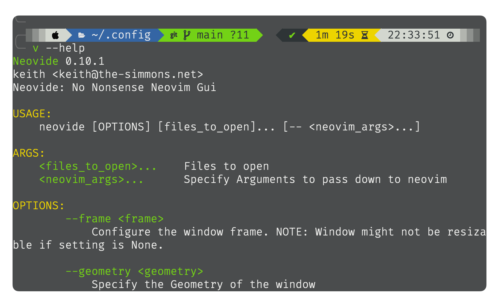

:sparkles: Personal work environment

:crystal_ball: **Terminal:**
- [Alacritty](https://github.com/alacritty/alacritty)

:crystal_ball: **Editor:**
- [neovim (TUI)](https://github.com/neovim/neovim)
- [neovide (GUI)](https://github.com/neovide/neovide)

:crystal_ball: **Shell:**
- [zsh (oh-my-zsh)](https://ohmyz.sh/)
  - [autosuggestions](https://github.com/zsh-users/zsh-autosuggestions/blob/master/INSTALL.md#oh-my-zsh)
  - [Syntax-highlighting](https://github.com/zsh-users/zsh-syntax-highlighting/blob/master/INSTALL.md)
  - [powerlevel10k](https://github.com/romkatv/powerlevel10k)

:crystal_ball: **CommandLine: **
- [navi](https://github.com/denisidoro/navi)
- [zoxide](https://github.com/ajeetdsouza/zoxide)
- [bat](https://github.com/sharkdp/bat)
- [exa](https://github.com/ogham/exa)
- [fd](https://github.com/sharkdp/fd)
- [ripgrep](https://github.com/BurntSushi/ripgrep)

Screenshots:

